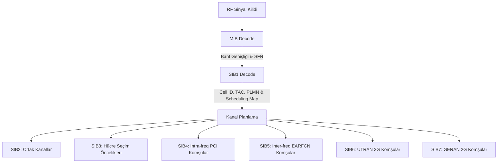
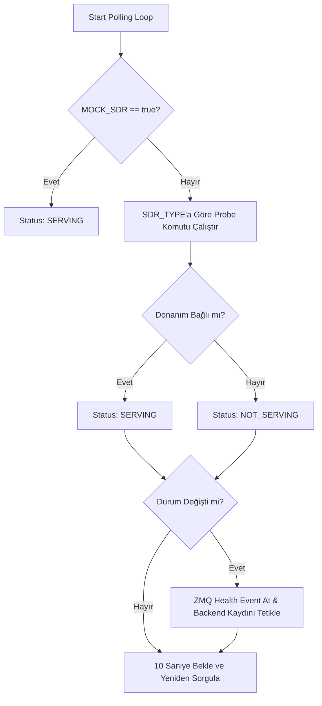

# 📡 LTE SDR Hardware Worker Microservice (hw-worker-sdr) Handoff Spec

Bu doküman, LTE pasif spektrum tarama ve SIB çözümleme donanım katmanını gRPC API servis arayüzü ile paketleyen **`hw-worker-sdr`** mikroservisinin sıfırdan kurulabilmesi, geliştirilmesi ve çalıştırılabilmesi için hazırlanan kapsamlı teknik handoff rehberidir.

---

## 1. Proje Özeti (Executive Summary)

### Ne Yapıyoruz?
Mobil ağ güvenliği ve radyo analiz süreçleri kapsamında, LTE spektrumundaki hücreleri pasif olarak tarayan, Master Information Block (MIB) ve System Information Blocks (SIB1-7) verilerini havadan (Over-The-Air) yakalayıp çözen bir **donanım worker mikroservisi** (`hw-worker-sdr`) geliştiriyoruz. 

### Neden?
Önceki mimaride yer alan tekil, izole ve bash-script tabanlı (`scan.py` ve `sib-scan.sh`) sistem, donanım kaynaklarını dinamik yönetememekte, dağıtık çalışmaya izin vermemekte ve gerçek zamanlı tarama verisi akışı (stream) sunamamaktadır. Bu mikroservis ile donanım katmanını ana Go backend'den ayırarak, docker konteynerlerinde bağımsız ölçeklenebilen, gRPC ile kontrol edilen ve ZeroMQ (ZMQ) ile gerçek zamanlı olay akışı sunan yüksek performanslı bir mimariye geçiyoruz.

### Mevcut Durum & Hedef
*   **Mevcut Durum**: Projede donanımdan izole çalışan Python betikleri ve statik SQLite çıktısı üreten bir `lte-sib-parser` konteyneri mevcuttur.
*   **Hedef**: Çoklu SDR (LimeSDR / USRP) ünitelerinin her birinin kendine ait birer `hw-worker-sdr` konteyneri olarak çalıştırılması, kendi rollerine (High/Low Band) göre EARFCN dağıtımı alması ve verileri gerçek zamanlı olarak merkez Go Backend'e ZMQ üzerinden akıtmasıdır.

---

## 2. Donanım ve SDR Konfigürasyonu

Sistem iki ana SDR donanım tipini destekler: **LimeSDR Mini 2.0** ve **Ettus USRP B205**.

### Donanım Parametreleri & Limitleri

| SDR Donanımı | Sürücü (Driver) | Anten Portu Eşlemesi | Frekans Limitleri | Optimal RX Kazancı |
| :--- | :--- | :--- | :--- | :--- |
| **LimeSDR Mini 2.0** | SoapySDR + LimeSuite (`soapysdr-module-lms7`) | **LNAH** (High Band: $\ge$ 1.5 GHz)<br>**LNAW** (Low Band: $<$ 1.5 GHz) | 10 MHz – 3.5 GHz | 35 dB – 45 dB |
| **USRP B205-mini** | UHD (`uhd-soapysdr` / `libuhd-dev`) | **TX/RX** veya **RX2** | 70 MHz – 6.0 GHz | 40 dB – 50 dB |

### Çift SDR Rol Ataması ve Otomatik EARFCN Ayrımı
LimeSDR donanım mimarisinde RF giriş portları fiziksel olarak optimize edilmiştir. Bu sebeple donanım kaynaklarını en verimli şekilde kullanmak amacıyla **çift SDR paralel tarama mimarisi** uygulanır:

1.  **High-Band Worker (`SDR_ROLE=high`)**: 1500 MHz ($\ge$ 1500 MHz) üzerindeki frekanslara atanan EARFCN listesinden sorumludur. LimeSDR üzerinde **LNAH** portu aktiftir.
2.  **Low-Band Worker (`SDR_ROLE=low`)**: 1500 MHz ($<$ 1500 MHz) altındaki frekanslara atanan EARFCN listesinden sorumludur. LimeSDR üzerinde **LNAW** portu aktiftir.

#### Otomatik Ayrım Algoritması (Go Core Orchestrator)
Orkestratör taranacak EARFCN listesini aldığında, her kanalın merkez frekansını hesaplar.
*   $F_{DL} \ge 1500\text{ MHz} \implies$ İstek `high-band` rolüne sahip donanım worker'ın gRPC IP/portuna yönlendirilir.
*   $F_{DL} < 1500\text{ MHz} \implies$ İstek `low-band` rolüne sahip donanım worker'ın gRPC IP/portuna yönlendirilir.

---

## 3. lte-sib-parser Altyapısı

Mikroservis, alt seviyede srsRAN 4G bileşenlerini kullanan `lte-sib-parser` projesinin çekirdek yeteneklerinden yararlanır.

### `sib-scan.sh` Parametre Yapısı
Sistem, ham srsue loglarını izlemek için aşağıdaki parametrelerle çalışır:
```bash
./sib-scan.sh -d soapy -a "rxant=LNAH" -g 40 -t 20 -T 10 -e 100 -d /vol/output/scan_campaign.sqlite
```
*   `-d`: SoapySDR veya UHD sürücü seçimi (`soapy` / `uhd`).
*   `-a`: Sürücü parametreleri (`rxant=LNAH` veya `rxant=LNAW`).
*   `-g`: Alıcı kazancı (Gain, dB cinsinden).
*   `-t`: İlk sinyal bulma timeout süresi (saniye).
*   `-T`: Başarılı çözülen her SIB için timeout süresine eklenecek ek süre (saniye).
*   `-e`: Taranacak EARFCN değeri.
*   `-d`: Çözülen MIB/SIB'lerin kaydedileceği SQLite dosya yolu.

### srsue Stdout JSON Çıktı Formatları

`srsue` çalışırken stdout üzerinde JSON formatında olaylar basar. Bu mikroservisin parse ettiği 4 temel JSON tipi şöyledir:

#### A. Sinyal Gücü Ölçümü (Power Measure)
```json
{"rsrp": -24.5}
```

#### B. MIB Çözümleme Çıktısı (Master Information Block)
```json
{
  "BCCH-BCH-Message": {
    "message": {
      "dl-Bandwidth": "n100",
      "phich-Config": {
        "phich-Duration": "normal",
        "phich-Resource": "one"
      },
      "systemFrameNumber": "10010101"
    }
  }
}
```

#### C. SIB1 Çözümleme Çıktısı (Cell Access Related Info)
```json
{
  "type": "sib1",
  "info": {
    "cellAccessRelatedInfo": {
      "cellIdentity": "0000000000000000000000001010",
      "trackingAreaCode": "0000000000001111",
      "plmn-IdentityList": [
        {
          "plmn-Identity": {
            "mcc": [2, 8, 6],
            "mnc": [0, 1]
          }
        }
      ]
    },
    "schedulingInfoList": [
      {
        "sib-MappingInfo": ["sibType3", "sibType5"]
      }
    ]
  }
}
```

#### D. SIB5 Çözümleme Çıktısı (Inter-frequency Neighbors)
```json
{
  "type": "sib5",
  "info": {
    "interFreqCarrierFreqList": [
      {
        "dl-CarrierFreq": 2850,
        "allowedMeasBandwidth": "mbw25",
        "cellReselectionPriority": 6,
        "threshX-High": 10,
        "threshX-Low": 10,
        "q-RxLevMin": -58
      }
    ]
  }
}
```

### dbparsers Yardımcı Scriptleri
`lte-sib-parser/vol/dbparsers/` altında yer alan scriptler veritabanını sorgular:
*   `list-cells.py`: SQLite veritabanındaki `cells` tablosundan taranan EARFCN, RSRP, MIB çözülme durumu ve SIB3 reselection priority önceliklerini listeler.
*   `get-info.py`: Belirli bir veritabanı veya EARFCN için TAC, 28-bit Cell Identity, PLMN (MCC/MNC) ve SIB5 inter-frequency komşu listelerini formatlı tablolar halinde yazdırır.
*   `get-sib.py`: İlgili EARFCN hücresine ait ham SIB JSON verisini sorgulayıp stdout'a basar.

---

## 4. LTE Domain ve Spektrum Bilgisi

### EARFCN ve Frekans Dönüşüm Formülleri
3GPP TS 36.101 standardına göre Downlink frekansı ($F_{DL}$) ve EARFCN ($N_{DL}$) arasındaki ilişki:
$$F_{DL} = F_{DL\_low} + 0.1 \times (N_{DL} - N_{Offs\text{-}DL})$$

### Türkiye LTE Spektrum Planı ve Operatör Dağılımı

| LTE Bandı | Frekans Sınıfı | $F_{DL\_low}$ (MHz) | $N_{Offs\text{-}DL}$ | Downlink EARFCN Sınırları | TR Operatör Dağılımı ve Taşıyıcı Kanalları |
| :---: | :---: | :---: | :---: | :---: | :--- |
| **Band 20** | 800 MHz | 791.0 | 6150 | 6150 – 6449 | **Türk Telekom**: 6200 (10 MHz)<br>**Vodafone**: 6300 (10 MHz)<br>**Turkcell**: 6400 (10 MHz) |
| **Band 8** | 900 MHz | 925.0 | 3450 | 3450 – 3799 | Operatörlerin dar bant GSM/LTE geçiş alanları |
| **Band 3** | 1800 MHz | 1805.0 | 1200 | 1200 – 1949 | **Turkcell**: 1350/1400 (20 MHz)<br>**Vodafone**: 1600 (10 MHz)<br>**Türk Telekom**: 1775 (20 MHz) |
| **Band 1** | 2100 MHz | 2110.0 | 0 | 0 – 599 | **Turkcell**: 100 (20 MHz) |
| **Band 7** | 2600 MHz | 2620.0 | 2750 | 2750 – 3449 | **Vodafone**: 2825 (15 MHz)<br>**Türk Telekom**: 3000 (20 MHz)<br>**Turkcell**: 3200 (20 MHz) |

### PLMN Operatör Eşlemesi
*   **`286-01`** veya `28601` $\implies$ **Turkcell**
*   **`286-02`** veya `28602` $\implies$ **Vodafone**
*   **`286-03`** veya `28603` $\implies$ **Türk Telekom**

### SIB Yapıları ve Decode Zinciri



---

## 5. Mevcut Çalışan Sistem ve Wiki Yapısı

### `scan.py` Akış Şeması
1.  **Girdi**: Kullanıcı taranacak EARFCN listesini boşlukla ayırarak girer (Örn: `python3 scan.py "100 1306 6400"`).
2.  **Otomatik Filtreleme & Port Ayrımı**: EARFCN'leri frekanslarına göre LNAH veya LNAW anten portu gruplarına böler.
3.  **Kullanıcı Onayı**: Anten kablosunun ilgili porta takılması için CLI üzerinde interaktif bekleme yapar.
4.  **Subprocess Başlatma**: `sib-scan.sh` aracını tetikler ve stdout akışını `select` modülü ile asenkron izler.
5.  **Anlık İlerleme**: Çözülen MIB, SIB1 ve SIB5 sayılarını CLI üzerinde `\r` ile güncelleyerek anlık gösterir.
6.  **Tablo Raporlaması**: Tarama bittiğinde ANSI renk kodlarıyla donatılmış Hücre Envanteri, Komşu Listesi ve Donanım Limit Keşif tablolarını terminale basar.
7.  **Wiki Güncelleme**: Çıkan sonuçları Markdown olarak Obsidian Wiki dizinine kaydeder ve Obsidian Graph exportunu tetikler.

### 6 Özel Ajan Skill'i (Custom Agent Skills)
Sistemin verimliliği, arka planda çalışan ve model davranışını yönlendiren 6 özel skill ile sağlanır:
1.  `writing-plans`: Teknik uygulama planlarının standart şablonda hazırlanmasını sağlar.
2.  `executing-plans`: Planların kontrollü ve geri alınabilir şekilde işletilmesini yönetir.
3.  `systematic-debugging`: Hataları bilimsel yöntemle (hipotez-test) çözmek için kılavuzluk sunar.
4.  `verification-before-completion`: İşlerin bittiğini iddia etmeden önce otomatik checkout ve kanıt sunmayı zorunlu kılar.
5.  `find-skills`: Sisteme eklenebilecek yeni donanım/yazılım yeteneklerini arar.
6.  `skill-creator`: Yeni ajan yetenekleri tasarlayıp paketlemeye yarar.

### Wiki Vault Yapısı
*   `/cells/`: Her keşfedilen hücre için `Cell_EARFCN[X]_PCI[Y].md` dosyası oluşturulur. İçinde SIB parametreleri ve komşuluk durumları wikilink formatında (`[[Cell_...]]`) tutulur.
*   `/logs/`: Tarama geçmişi metriklerini barındırır.
*   `/references/`: Frekans ve band aralıkları tablolarını tutar.
*   `/concepts/`: EARFCN formülleri gibi teorik sayfaları barındırır.

### Gerçek Tarama Sonucu Örneği (EARFCN 100)
`EARFCN 100` tarandığında ortaya çıkan gerçek veri kümesi:
*   **Merkez Frekansı**: 2120.0 MHz (Band 1)
*   **Operatör**: Turkcell (286-01)
*   **PCI**: 265
*   **Cell ID**: 8848993
*   **TAC**: 8481
*   **RSRP**: -24.5 dBm
*   **Çözülen SIB'ler**: MIB, SIB1, SIB2, SIB3, SIB5
*   **Komşular**:
    *   `EARFCN 2850 (PCI 192)`: Tek Yönlü Komşu
    *   `EARFCN 6400 (PCI 189)`: Çift Yönlü Komşu
    *   `EARFCN 550`, `EARFCN 1651`, `EARFCN 1795`: Taranmamış Komşular (Kuyrukta)

---

## 6. Hedef Mimari

Mikroservis, tüm radyo izleme sisteminin donanım soyutlama katmanı (Hardware Abstraction Layer) olarak görev yapar.

```
+-------------------------------------------------------------+
|                        Tauri GUI Frontend                   |
|                   (React / TypeScript Desktop App)          |
+------------------------------+------------------------------+
                               | (IPC / WebSocket)
                               v
+-------------------------------------------------------------+
|                          Go Backend                         |
|                 (Central Orchestrator Core)                 |
+--------------+-------------------------------+--------------+
               |                               ^
               | (gRPC Control Plane)          | (ZMQ PUB/SUB Data Plane)
               | SDRWorkerService              | sdr_{serial}_scan_progress
               v                               |
+----------------------------------------------+--------------+
|                     hw-worker-sdr Instance                  |
|                 (SDR Hardware Python Worker)                |
|  +-------------------------------------------------------+  |
|  |           srsue (srsRAN direct subprocess)            |  |
|  |                   (RF Frontend & SIBs)                |  |
|  +---------------------------+---------------------------+  |
|                              | Writes results              |
|                              v                             |
|  +-------------------------------------------------------+  |
|  |             SQLite DB (/vol/output/scan_*.db)         |  |
|  +-------------------------------------------------------+  |
+-------------------------------------------------------------+
                               |
                        Go Core imports & persists
                               v
+-------------------------------------------------------------+
|                        ClickHouse DB                        |
|                  (Historical Analytics Database)            |
+-------------------------------------------------------------+
```

---

## 7. hw-worker-sdr Repo Yapısı

Proje dosyaları ve sorumluluk sınırları şu şekildedir:

```
hw-worker-sdr/
├── proto/
│   └── sdr_worker.proto          # gRPC API metodları ve mesaj tipleri
├── src/
│   ├── main.py                   # Giriş noktası, ZMQ/gRPC başlatıcı, Service Discovery
│   ├── grpc_server.py            # SDRWorkerService API servis implementasyonu
│   ├── zmq_publisher.py          # Gerçek zamanlı tarama ve durum olayları PUB soketi
│   ├── device_manager.py         # Donanım varlık kontrolü (probe) ve Reconnect Loop
│   ├── sib_scanner.py            # srsue ve parser'ı subprocess olarak asenkron yöneten sınıf
│   ├── earfcn_validator.py       # Rol ve 3GPP standartlarına göre girdi doğrulama modülü
│   ├── result_parser.py          # SQLite database parser (hücre parametre çözücü)
│   ├── neighbor_analyzer.py      # SIB4/5/6/7 komşu eşleme ve topoloji motoru
│   └── config.py                 # Pydantic tabanlı .env konfigürasyon sınıfı
├── tests/
│   └── test_microservice.py      # pytest test suite dosyamız
├── Dockerfile                    # UHD + LimeSuite + srsRAN derleyici Docker imajı
├── requirements.txt              # Bağımlılık paket listesi
└── README.md                     # Kurulum, API çağrı ve test kılavuzu
```

---

## 8. Ortam Değişkenleri (.env.example)

Projenin tüm yapılandırması ortam değişkenleri üzerinden yönetilir. 

```bash
# hw-worker-sdr/src/config.py tarafından otomatik okunur
GRPC_PORT=50051
ZMQ_PUB_PORT=5556
BACKEND_GRPC_ADDR=localhost:50050

SDR_TYPE=limesdr          # limesdr veya usrp
SDR_SERIAL=1DBB4CC5EE717D # Cihaz USB Seri Numarası
SDR_ROLE=high             # high veya low

# Opsiyonel: Boş bırakılırsa SDR_TYPE ve SDR_ROLE'e göre otomatik türetilir
SDR_ANTENNA=LNAH

FREQ_THRESHOLD_MHZ=1500
DEFAULT_GAIN=40
DEFAULT_TIMEOUT=20
DEFAULT_EXTRA_TIMEOUT=10
MOCK_SDR=false
```

### Parametre Türetme Tablosu (Anten ve Sürücü Eşleme)

| `SDR_TYPE` | `SDR_ROLE` | Türetilen `driver` | Türetilen `antenna` (Varsayılan) | Açıklama |
| :--- | :--- | :--- | :--- | :--- |
| `limesdr` | `high` | `soapy` | `LNAH` | LimeSDR High Band (Frekans $\ge$ 1.5 GHz) |
| `limesdr` | `low` | `soapy` | `LNAW` | LimeSDR Low Band (Frekans $<$ 1.5 GHz) |
| `usrp` | `high` | `uhd` | `TX/RX` | USRP High Band |
| `usrp` | `low` | `uhd` | `RX2` | USRP Low Band (Özel alıcı anten portu) |

---

## 9. gRPC Protobuf Tanımı (`sdr_worker.proto`)

Aşağıda mikroservis tarafından sunulan gRPC API arayüzünün tam protobuf şeması yer almaktadır:

```protobuf
syntax = "proto3";

package sdr_worker;

service SDRWorkerService {
  // Donanım saglik ve durum bilgisini döner.
  rpc GetHealth(Empty) returns (HealthResponse);

  // Girdi EARFCN listesinin donanim rolüne ve limitlerine uygunlugunu dogrular.
  rpc ValidateEarfcns(EarfcnRequest) returns (ValidationResult);

  // Asenkron olarak bir tarama kampanyasi baslatir.
  rpc StartScan(ScanRequest) returns (ScanResponse);

  // Aktif taramanin durumunu ve anlik ilerleme metriklerini sorgular.
  rpc GetScanStatus(ScanStatusRequest) returns (ScanStatusResponse);

  // Tamamlanan veya durdurulan taramanin hücre envanterini döner.
  rpc GetScanResults(ScanResultsRequest) returns (ScanResultsResponse);

  // Belirli bir taramadaki tek bir hücrenin detayli parametrelerini döner.
  rpc GetCellInfo(CellRequest) returns (CellInfoResponse);

  // Bir hücrenin bildirdigi tüm SIB4/5/6/7 komsu listesini döner.
  rpc GetNeighbors(CellRequest) returns (NeighborResponse);

  // Tarama sonucundaki tüm hücreler arasi komsuluk topolojisini analiz eder.
  rpc GetNeighborMap(ScanResultsRequest) returns (NeighborMapResponse);

  // SIB5'te bulunup henüz bu kampanya kapsaminda taranmamis olan EARFCN listesini döner.
  rpc GetUnscannedEarfcns(ScanResultsRequest) returns (EarfcnList);

  // Devam eden bir taramayi zorla sonlandirir.
  rpc StopScan(ScanResultsRequest) returns (StopResponse);
}

message Empty {}

message HealthResponse {
  string status = 1;      // SERVING, NOT_SERVING
  string sdr_type = 2;    // limesdr, usrp
  string serial = 3;      // USB Serial
  string role = 4;        // high, low
  string antenna = 5;     // LNAH, LNAW, TX/RX, RX2
  double uptime = 6;      // Saniye cinsinden
}

message EarfcnRequest {
  repeated int32 earfcns = 1;
}

message EarfcnValidation {
  int32 earfcn = 1;
  int32 band = 2;
  double freq_mhz = 3;
  bool is_valid = 4;
  string error_message = 5;
  string antenna_port = 6;
}

message ValidationResult {
  repeated EarfcnValidation validations = 1;
  bool all_valid = 2;
}

message ScanRequest {
  repeated int32 earfcns = 1;
  int32 gain = 2;
  int32 timeout = 3;
  int32 extra_timeout = 4;
}

message ScanResponse {
  string scan_id = 1;
  bool started = 2;
  string message = 3;
}

message ScanStatusRequest {
  string scan_id = 1;
}

message ScanStatusResponse {
  string scan_id = 1;
  string status = 2;           // IDLE, RUNNING, COMPLETED, STOPPED, FAILED, NOT_FOUND
  int32 current_earfcn = 3;
  string current_step = 4;     // Örn: "2/5"
  repeated string decoded_sibs = 5; // Örn: ["MIB", "SIB1", "SIB5"]
}

message ScanResultsRequest {
  string scan_id = 1;
}

message CellInfo {
  int32 earfcn = 1;
  int32 band = 2;
  double freq_mhz = 3;
  int32 pci = 4;
  int64 cell_id = 5;
  string plmn = 6;
  string operator_name = 7;
  int32 tac = 8;
  double rsrp = 9;
  string bandwidth = 10;
  repeated string sibs_decoded = 11;
}

message ScanResultsResponse {
  string scan_id = 1;
  repeated CellInfo cells = 2;
}

message CellRequest {
  string scan_id = 1;
  int32 earfcn = 2;
}

message CellInfoResponse {
  bool found = 1;
  CellInfo cell = 2;
}

message NeighborInfo {
  int32 neighbor_earfcn = 1;
  int32 neighbor_band = 2;
  double neighbor_freq = 3;
  int32 priority = 4;
  int32 thresh_x_high = 5;
  int32 thresh_x_low = 6;
  string bandwidth = 7;
  string neighbor_type = 8; // intra, inter, utran, geran
  int32 pci_or_psc = 9;
}

message NeighborResponse {
  int32 earfcn = 1;
  repeated NeighborInfo neighbors = 2;
}

message NeighborRelation {
  string cell_a = 1;         // Örn: "100 (PCI 265)"
  string cell_b = 2;         // Örn: "2850 (Taranmamis)" veya "6400 (PCI 189)"
  string direction = 3;      // "→", "↔"
  string relation_type = 4;  // Unidirectional, Bidirectional, Unscanned
}

message NeighborMapResponse {
  string scan_id = 1;
  repeated NeighborRelation relations = 2;
}

message EarfcnList {
  repeated int32 earfcns = 1;
}

message StopResponse {
  string scan_id = 1;
  bool stopped = 2;
  string message = 3;
}
```

---

## 10. ZMQ Topic ve Olay (Event) Yapısı

Mikroservis, tarama sürecindeki tüm anlık olayları ve donanım sağlık durumlarını **ZMQ PUB** soketi üzerinden dış dünyaya akıtır.

### Olay Mesajı Formatı
Bütün mesajlar ZMQ üzerinde string tabanlı `"{topic} {payload_json}"` formatında yayınlanır.

### Topic Listesi ve Payload Örnekleri

#### 1. Donanım Sağlık Değişimi (`sdr_{serial}_health`)
Cihaz bağlandığında veya koptuğunda yayınlanır:
```json
// Topic: sdr_1DBB4CC5EE717D_health
{
  "event": "device_status_changed",
  "status": "SERVING", // veya "NOT_SERVING"
  "timestamp": 1780324101.5
}
```

#### 2. Frekans Ayarlama Olayı (`sdr_{serial}_scan_progress`)
Tarayıcı yeni bir kanala geçtiğinde tetiklenir:
```json
// Topic: sdr_1DBB4CC5EE717D_scan_progress
{
  "event": "tuning",
  "scan_id": "8a32bc51",
  "earfcn": 1300,
  "step": "2/6",
  "timestamp": 1780324110.2
}
```

#### 3. SIB Decode Başarısı (`sdr_{serial}_scan_progress`)
Havadan yeni bir bilgi bloğu çözüldüğünde tetiklenir:
```json
// Topic: sdr_1DBB4CC5EE717D_scan_progress
{
  "event": "decoded",
  "scan_id": "8a32bc51",
  "earfcn": 1300,
  "sib_type": "SIB1",
  "timestamp": 1780324112.9
}
```

#### 4. Kanal Tarama Sonu (`sdr_{serial}_scan_progress`)
Kanalın süresi bittiğinde veya tüm SIB'ler tamamlandığında:
```json
// Topic: sdr_1DBB4CC5EE717D_scan_progress
{
  "event": "channel_finished",
  "scan_id": "8a32bc51",
  "earfcn": 1300,
  "status": "SUCCESS", // veya "TIMEOUT"
  "timestamp": 1780324125.1
}
```

---

## 11. Hizmet Keşfi (Service Discovery) ve Kayıt

Mikroservis başarıyla ayağa kalkıp donanımı `SERVING` durumuna getirdiğinde, Go orkestratörüne (`BACKEND_GRPC_ADDR`) kendini kaydeder.

### `RegisterMicroservice` gRPC İstek Şeması
*   **`device_type`**: `"SDR_LIMESDR"` veya `"SDR_USRP"` (yapılandırmaya göre)
*   **`capabilities`**: `["SIB_PARSE", "NEIGHBOR_DISCOVERY", "CELL_SEARCH", "FREQ_SCAN"]` (sabit yetenek listesi)
*   **`control_endpoint`**: `"localhost:{GRPC_PORT}"` (Go backend'in bu donanıma gRPC komutları göndereceği adres)
*   **`data_endpoint`**: `"tcp://localhost:{ZMQ_PUB_PORT}"` (Go backend'in anlık olayları dinleyeceği ZMQ adresi)
*   **`metadata`**:
    *   `serial`: `SDR_SERIAL` (Örn: `"1DBB4CC5EE717D"`)
    *   `role`: `SDR_ROLE` (Örn: `"high"` veya `"low"`)
    *   `antenna`: `SDR_ANTENNA` (Örn: `"LNAH"`)

---

## 12. Device Manager ve Donanım Denetimi

`device_manager.py`, fiziksel SDR donanımının USB portundaki varlığını izleyen ve kesintisiz yeniden bağlantı (reconnect loop) sağlayan kritik arka plan iş parçacığıdır.



### Donanım Arama Probe Komutları
*   **LimeSDR için**: `LimeUtil --find`
*   **USRP için**: `uhd_find_devices`

---

## 13. `sib_scanner.py` Tasarımı ve Alt Süreç Yönetimi

`sib_scanner.py` modülü, `srsue` ikili dosyasını doğrudan işletim sistemi üzerinde bir asenkron alt süreç (subprocess) olarak başlatır.

### Doğrudan Çağrı Komut Tasarımı
Mikroservis, `srsue` aracını şu parametrelerle doğrudan tetikler:
```python
cmd = [
    "srsue",
    "--rf.device_name=soapy",
    "--rf.device_args=rxant=LNAH",
    "--rf.rx_gain=40",
    "--expert.earfcn=1300",
    "--expert.database_path=/vol/output/scan_8a32bc51.sqlite"
]
```

### Stdout Okuma ve ZMQ Entegrasyon Döngüsü
```python
# Asenkron subprocess baslatma
process = subprocess.Popen(
    cmd,
    stdout=subprocess.PIPE,
    stderr=subprocess.STDOUT,
    text=True,
    bufsize=1
)

# Gerçek zamanli stdout izleme döngüsü
for line in iter(process.stdout.readline, ""):
    line_strip = line.strip()
    
    # srsue'nin bastigi JSON bloklarini yakalama
    if line_strip.startswith("{") and line_strip.endswith("}"):
        try:
            event_data = json.loads(line_strip)
            if "rsrp" in event_data:
                # ZMQ progress event yayinla
                zmq_pub.publish("progress", {"event": "rsrp", "rsrp": event_data["rsrp"]})
            elif "type" in event_data:
                sib_type = event_data["type"].upper()
                # ZMQ decoded event yayinla
                zmq_pub.publish("progress", {"event": "decoded", "sib_type": sib_type})
        except Exception:
            pass
```

### StopScan ve Graceful Kill Mantığı
Kullanıcı taramayı durdurduğunda veya kanal süresi dolduğunda, mikroservis alt süreci kibarca kapatır:
1.  İlk olarak sürece **`SIGINT` (Ctrl+C)** sinyali gönderilir (`process.terminate()`). Bu, `srsue`'nin SQLite veritabanına kalan tamponları yazıp güvenli kapanmasını sağlar.
2.  Süreç 3 saniye içinde kapanmazsa, veri bozulmasını göze alarak **`SIGKILL`** (`process.kill()`) ile zorla sonlandırılır.

---

## 14. Kritik Tasarım Kararları

| Karar Başlığı | Tercih Edilen Tasarım | Neden? |
| :--- | :--- | :--- |
| **Rekürsif Tarama İptali** | Backend Seviyesine Çekildi | Rekürsif tarama mantığı donanım worker seviyesinde karmaşıklığa yol açmaktadır. Karar mekanizmasını Go Core Backend yönetmeli, worker ise sadece kendisine verilen EARFCN listesini doğrusal taramalıdır. |
| **Wrapper Script İptali** | Subprocess ile Doğrudan `srsue` Çağrısı | `sib-scan.sh` katmanı, PID yönetimi, sinyal kesintileri ve stdout yönlendirmelerinde kararsızlığa yol açmaktadır. Doğrudan Python `subprocess.Popen` kullanımı daha temiz PID kontrolü ve asenkron log takibi sağlar. |
| **Ağ Yapılandırması** | `host` Networking | SoapySDR ve UHD donanım sürücülerinin USB/IP üzerinden SDR aygıtlarını sıfır gecikme ile keşfedebilmesi için konteynerin ana makine ağ arayüzünü (`--network host`) doğrudan kullanması zorunludur. |
| **Ara Depolama** | SQLite Veritabanı | Çözümlenen SIB ikili verilerinin ham JSON hallerini ve yapılandırılmış tabloları kampanya bazlı hızlıca lokalde tutmak için en hafif, sıfır-konfigürasyonlu ve kararlı çözüm SQLite'tır. |
| **Data Plane** | ZeroMQ (ZMQ) | SIB decode ve donanım olaylarının yüksek frekansta, minimum gecikmeyle ve kesintisiz (UDP/TCP PUB) Go Backend'e akıtılması için ZMQ en performanslı asenkron haberleşme kütüphanesidir. |

---

## 15. Docker ve Sistem Kurulumu

### Çoklu Worker Docker Compose Örneği (`docker-compose.yml`)
Aşağıdaki yapılandırma, tek makinede biri High-Band diğeri Low-Band olarak atanmış iki ayrı LimeSDR ünitesini çalıştırır:

```yaml
version: '3.8'

services:
  sdr_worker_high:
    image: hw-worker-sdr:latest
    container_name: sdr_worker_high
    network_mode: host
    privileged: true
    restart: unless-stopped
    devices:
      - "/dev/bus/usb:/dev/bus/usb"
    environment:
      - GRPC_PORT=50051
      - ZMQ_PUB_PORT=5556
      - SDR_TYPE=limesdr
      - SDR_SERIAL=1DBB4CC5EE717D # Yüksek Band Cihaz
      - SDR_ROLE=high
      - BACKEND_GRPC_ADDR=localhost:50050
    volumes:
      - /opt/netmon/output:/vol/output

  sdr_worker_low:
    image: hw-worker-sdr:latest
    container_name: sdr_worker_low
    network_mode: host
    privileged: true
    restart: unless-stopped
    devices:
      - "/dev/bus/usb:/dev/bus/usb"
    environment:
      - GRPC_PORT=50052
      - ZMQ_PUB_PORT=5557
      - SDR_TYPE=limesdr
      - SDR_SERIAL=1DBB4CC5EE799A # Düşük Band Cihaz
      - SDR_ROLE=low
      - BACKEND_GRPC_ADDR=localhost:50050
    volumes:
      - /opt/netmon/output:/vol/output
```

### SDR UDEV Kuralları (`/etc/udev/rules.d/`)
SDR donanımlarının docker içerisinde `root` izni olmadan da erişilebilir olması için ana makinede aşağıdaki kuralların bulunması şarttır:

#### `/etc/udev/rules.d/64-limesdr.rules`
```udev
SUBSYSTEM=="usb", ATTR{idVendor}=="0403", ATTR{idProduct}=="601f", MODE="0666", GROUP="plugdev"
```

#### `/etc/udev/rules.d/10-usrp.rules`
```udev
SUBSYSTEM=="usb", ATTR{idVendor}=="2514", ATTR{idProduct}=="0011", MODE="0666", GROUP="plugdev"
```

---

## 16. Test ve Doğrulama Stratejisi

### 1. `grpcurl` ile gRPC API Doğrulaması
```bash
# GetHealth metodunu tetikleme
grpcurl -plaintext localhost:50051 sdr_worker.SDRWorkerService/GetHealth

# ValidateEarfcns metodunu taranabilir kanallarla test etme
grpcurl -plaintext -d '{"earfcns": [100, 6400]}' localhost:50051 sdr_worker.SDRWorkerService/ValidateEarfcns

# StartScan ile asenkron tarama kampanyası başlatma
grpcurl -plaintext -d '{"earfcns": [100], "gain": 40}' localhost:50051 sdr_worker.SDRWorkerService/StartScan
```

### 2. Python ZMQ Subscriber Test Scripti
Aşağıdaki betik, `hw-worker-sdr` ZMQ soketine bağlanarak gelen tüm anlık olayları CLI üzerine yazdırır:

```python
import zmq
import json

def start_subscriber(port=5556):
    context = zmq.Context()
    socket = context.socket(zmq.SUB)
    socket.connect(f"tcp://localhost:{port}")
    
    # Bütün progress ve health olaylarina abone ol
    socket.setsockopt_string(zmq.SUBSCRIBE, "")
    
    print(f"📡 ZMQ Alıcısı tcp://localhost:{port} portunda başlatıldı. Olaylar bekleniyor...")
    try:
        while True:
            message = socket.recv_string()
            parts = message.split(" ", 1)
            topic = parts[0]
            payload = json.loads(parts[1]) if len(parts) > 1 else {}
            
            print(f"🔔 Topic: {topic:<30} | Event: {payload.get('event', 'N/A'):<15} | Data: {payload}")
    except KeyboardInterrupt:
        print("\nAlıcı kapatılıyor.")

if __name__ == "__main__":
    start_subscriber()
```

---

## 17. Yazılımcı Teslim Checklist (Handoff Checklist)

Yazılımcı projeyi devraldığında sırasıyla aşağıdaki adımları gerçekleştirmelidir:

- [ ] **1. Ortam Kurulumu**: Python 3.10+ ve virtual env (`python3 -m venv venv`) kurularak aktif edilmeli.
- [ ] **2. Sürücü ve Paket Bağımlılıkları**: UHD ve LimeSuite bağımlılıkları `apt` üzerinden kurulmalı, `requirements.txt` paketleri (`pip install -r requirements.txt`) yüklenmeli.
- [ ] **3. Proto Derlemesi**: `sdr_worker.proto` dosyası `grpc_tools.protoc` kullanılarak Python kodlarına başarıyla derlenmeli.
- [ ] **4. Yapılandırma Kontrolü**: `.env` dosyası oluşturulmalı ve `MOCK_SDR=true` yapılarak yerel donanımsız test moduna geçilmeli.
- [ ] **5. Test Suite Çalıştırılması**: `PYTHONPATH=. pytest tests/` komutu çalıştırılarak validator, config, database ve analyzer birim testlerinin geçtiği doğrulanmalı.
- [ ] **6. Docker Derlemesi**: `docker build -t hw-worker-sdr .` ile Docker imajı lokalde başarıyla üretilmeli.
- [ ] **7. Donanım Bağlantısı**: LimeSDR veya USRP USB portuna takılmalı, `LimeUtil --find` / `uhd_find_devices` çıktıları doğrulanmalı.
- [ ] **8. UDEV Kuralları**: Ana makinede udev kuralları eklenmeli ve USB port yetkileri (`MODE="0666"`) ayarlanmalı.
- [ ] **9. Entegrasyon Testi**: `grpcurl` ile `StartScan` komutu gönderilmeli ve ZMQ test scripti üzerinden olayların aktığı gözlemlenmeli.
- [ ] **10. Go Backend Entegrasyonu**: Go Core orkestratörü çalıştırılmalı ve `RegisterMicroservice` çağrısının başarıyla tamamlandığı loglardan teyit edilmeli.
