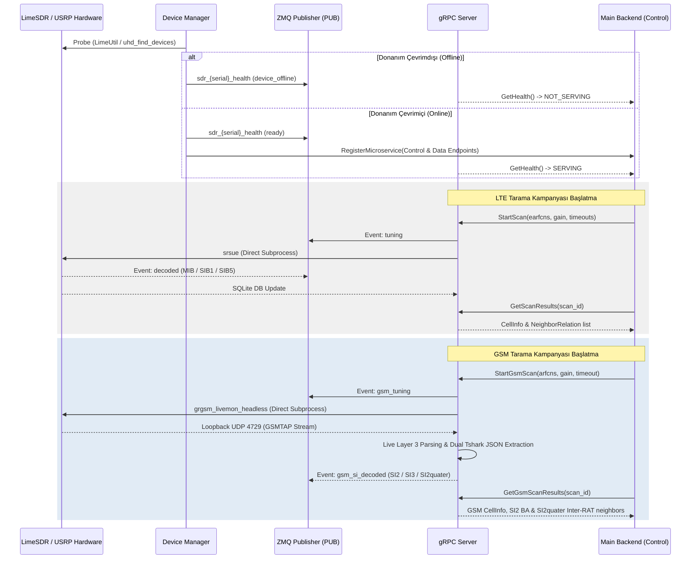

# 📡 hw-worker-sdr: LTE & GSM SDR Hardware Worker Microservice

Bu mikroservis, pasif LTE spektrum tarama ve SIB çözümleme (`srsue`) donanım katmanının yanı sıra pasif GSM tarama, deşifre ve komşu hücre tespit (`gr-gsm` tabanlı) yeteneklerini gRPC API servis arayüzü ile paketleyen ve **`lte-sib-parser`** & **`gsm-neighbor-scanner`** ile doğrudan entegre olan ortak donanım worker servisidir. 

Proje mimarisi gereğince, her SDR aygıtı (LimeSDR Mini 2.0 veya USRP B205) kendine özel bir konteyner örneği (instance) olarak çalışır. Yüksek frekans bandı (>= 1.5 GHz) ve düşük frekans bandı (< 1.5 GHz) taramaları, paralel olarak iki ayrı worker konteyneri tarafından yönetilir.

---

## 🏗️ Servis Mimarisi ve Akış Diyagramı

Worker ilk ayağa kalktığında donanımı kontrol eder ve ardından kendini ana Backend'e kaydeder (Service Discovery). Donanım çakışmalarını önlemek için LTE ve GSM tarama süreçleri kilit (lock) mekanizması ile izole çalışır.



---

## 📂 Repo Yapısı

```
hw-worker-sdr/
├── proto/
│   ├── sdr_worker.proto          # gRPC servis ve mesaj tanımları
│   ├── sdr_worker_pb2.py         # Derlenmiş gRPC mesaj sınıfları
│   └── sdr_worker_pb2_grpc.py    # Derlenmiş gRPC servis stubs
├── src/
│   ├── main.py                   # Mikroservis entry point ve Registration
│   ├── grpc_server.py            # gRPC API implementasyonu
│   ├── zmq_publisher.py          # ZMQ PUB ile real-time progress yayını
│   ├── device_manager.py         # SDR donanım kontrolü ve reconnect döngüsü
│   ├── config.py                 # Pydantic BaseSettings config
│   │
│   # --- LTE Components ---
│   ├── sib_scanner.py            # srsue subprocess yönetimi ve stdout parse
│   ├── earfcn_validator.py       # 3GPP TS 36.101 standardı doğrulama
│   ├── result_parser.py          # SQLite veritabanı okuma (sqlite3)
│   ├── neighbor_analyzer.py      # SIB4/5/6/7 komşu ve yön analizörü
│   │
│   # --- GSM Components ---
│   ├── gsm_scanner.py            # grgsm_scanner / livemon subprocess yönetimi, dual tshark parsing
│   ├── gsm_arfcn_validator.py    # GSM900 / DCS1800 3GPP TS 45.005 doğrulama
│   ├── gsmtap_parser.py          # L3 GSMTAP RR deşifre motoru (SI3, SI2, SI2quater skeleton)
│   └── gsm_neighbor_analyzer.py  # SI2 BA & SI2quater inter-RAT komşu & cross-link analizörü
│
├── tests/
│   └── test_microservice.py      # pytest test paketi (LTE + GSM entegrasyon testleri)
├── Dockerfile                    # Çoklu sürücü (UHD + LimeSuite + gr-gsm) Docker imajı
├── requirements.txt              # Bağımlılık listesi
├── .env.example                  # Çevre değişkenleri şablonu
└── README.md                     # Kurulum ve test dokümantasyonu
```

---

## ⚙️ Çevre Değişkenleri (.env)

| Değişken | Açıklama | Varsayılan |
| :--- | :--- | :--- |
| `GRPC_PORT` | gRPC servisinin dinleyeceği port | `50051` |
| `ZMQ_PUB_PORT` | ZMQ real-time olay yayınlama portu | `5556` |
| `BACKEND_GRPC_ADDR` | Main Backend'in kontrol RPC adresi | `localhost:50050` |
| `SDR_TYPE` | Donanım modeli (`limesdr` veya `usrp`) | `limesdr` |
| `SDR_SERIAL` | Cihazın USB seri numarası | `""` |
| `SDR_ROLE` | Taramadan sorumlu olduğu band rolü (`high` / `low`) | `high` |
| `SDR_ANTENNA` | Anten portu seçimi (Boş bırakılırsa rolüne göre otomatik seçilir) | `""` |
| `FREQ_THRESHOLD_MHZ`| Yüksek/Düşük band ayrım frekansı (MHz) | `1500` |
| `DEFAULT_GAIN` | SDR RX kazancı (dB) | `40` |
| `DEFAULT_TIMEOUT` | Kanal başına tarama süresi (sn) | `20` |
| `GSM_TIMEOUT_PER_ARFCN` | GSM kanal başına tarama süresi (sn) | `15` |
| `GSM_UDP_PORT` | gr-gsm livemon çıktısının dinleneceği UDP portu | `4729` |
| `DEVICE_PATH` | SDR udev symlink düğümü | `/dev/sdr_device_1` |
| `MOCK_SDR` | Donanımsız test ortamları için simülatör modu | `false` |

---

## 🛠️ Kurulum ve Çalıştırma

### 1. Yerel Virtual Environment ile Başlatma

Öncelikle proto dosyalarını derlemek ve servisleri ayağa kaldırmak için:

```bash
# 1. Sanal ortam oluşturun ve paketleri kurun
python3 -m venv venv
source venv/bin/activate
pip install -r requirements.txt

# 2. Proto dosyalarını Python modüllerine derleyin
python3 -m grpc_tools.protoc -I. --python_out=. --grpc_python_out=. proto/sdr_worker.proto

# 3. Servisi başlatın (Donanım yoksa .env dosyasında MOCK_SDR=true yapın)
PYTHONPATH=. python3 src/main.py
```

### 2. Docker Konteyner Derleme ve Çalıştırma

```bash
# Docker imajını derleyin (Build sırasında srsRAN ve gr-gsm derlenecektir)
docker build -t hw-worker-sdr:latest .

# Düşük Band (GSM900) SDR 2 Örneği Çalıştırma:
docker run -d \
  --name sdr_worker_low \
  --network host \
  --device /dev/sdr_device_low:/dev/sdr_device_1 \
  -e GRPC_PORT=50051 \
  -e ZMQ_PUB_PORT=5556 \
  -e SDR_TYPE=limesdr \
  -e SDR_SERIAL=1DBB4CC5EE717D \
  -e SDR_ROLE=low \
  --restart unless-stopped \
  hw-worker-sdr:latest
```

---

## 🧪 Entegrasyon Testleri ve API Kullanımı

### 1. gRPC API Testi (`grpcurl`)

Mikroservisin sunduğu tüm LTE ve GSM metodlarını `grpcurl` ile test edebilirsiniz.

```bash
# Servis şemasını listeleme
grpcurl -plaintext localhost:50051 list

# Health Status alma
grpcurl -plaintext localhost:50051 sdr_worker.SDRWorkerService/GetHealth

# GSM ARFCN Validation Testi (GSM900 ARFCN 60 ve DCS1800 ARFCN 600 için)
grpcurl -plaintext -d '{"arfcns": [60, 600]}' localhost:50051 sdr_worker.SDRWorkerService/ValidateArfcns

# GSM Hedefli (Targeted) Tarama Başlatma
grpcurl -plaintext -d '{"arfcns": [60], "gain": 35, "timeout": 15}' localhost:50051 sdr_worker.SDRWorkerService/StartGsmScan

# GSM Full-Band Tarama Başlatma
grpcurl -plaintext -d '{"band": "GSM900", "gain": 35}' localhost:50051 sdr_worker.SDRWorkerService/StartGsmBandScan

# GSM Tarama Sonuçlarını Çekme
grpcurl -plaintext -d '{"scan_id": "gsm_scan_xyz"}' localhost:50051 sdr_worker.SDRWorkerService/GetGsmScanResults

# GSM Inter-RAT (3G/4G) Komşuları Listeleme
grpcurl -plaintext -d '{"scan_id": "gsm_scan_xyz"}' localhost:50051 sdr_worker.SDRWorkerService/GetGsmInterRatNeighbors
```

### 2. ZMQ Real-time Event İzleme (Python SUB Örneği)

Real-time yayınlanan LTE progress / SIB olaylarını ve GSM deşifre olaylarını (`gsm_si_decoded`) dinlemek için basit bir Python abonesi:

```python
import zmq
import json

context = zmq.Context()
socket = context.socket(zmq.SUB)
socket.connect("tcp://localhost:5556")

# SDR seri numarasına göre tüm hücresel olayları dinliyoruz
serial = "1DBB4CC5EE717D"
socket.setsockopt_string(zmq.SUBSCRIBE, f"sdr_{serial}_scan_progress")
socket.setsockopt_string(zmq.SUBSCRIBE, f"sdr_{serial}_health")

print(f"📡 SDR {serial} olay akışı izleniyor...")
while True:
    message = socket.recv_string()
    topic, payload = message.split(" ", 1)
    try:
        data = json.loads(payload)
        # GSM deşifre olaylarını özel olarak yakalayalım
        if data.get("event") == "gsm_si_decoded":
            print(f"[{topic}] 🔓 {data['si']} çözüldü | ARFCN: {data['arfcn']} | Veri: {data}")
        else:
            print(f"[{topic}] -> {data}")
    except Exception:
        print(f"[{topic}] -> {payload}")
```
