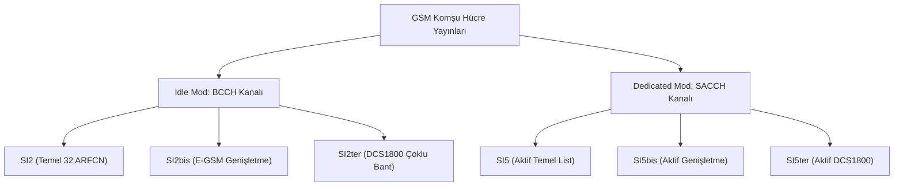

# GSM Komşu Hücre Analizi (GSM Neighbor Cell Analysis)

**GSM Komşu Hücre Analizi**, bir mobil istasyonun (MS) bekleme (idle) veya aktif çağrı (dedicated) durumunda kesintisiz servis almasını (handover / reselection) sağlamak amacıyla baz istasyonunun (BTS) yayınladığı komşu hücre listelerinin ve parametrelerinin pasif yöntemlerle çözümlenmesi ve analiz edilmesidir.

LTE şebekelerinde SIB (System Information Block) paketleri ile yapılan bu komşu tespit işlemi, GSM şebekelerinde **System Information (SI)** mesajları ve **BA (BCCH Allocation)** listeleri üzerinden gerçekleştirilir.

---

## 1. Temel Kavramlar ve BA Listeleri

GSM standardında mobil istasyonların izlemesi gereken komşu hücre ARFCN kanalları iki temel liste halinde baz istasyonu tarafından iletilir:

### A. BA (BCCH) Listesi — bekleme (Idle) Modu
Mobil istasyon bekleme modundayken en iyi sinyal veren hücreye kamp (cell reselection) kurabilmek için bu listedeki komşu hücre frekanslarını sürekli dinler.
* **İletildiği Kanal:** BCCH (Broadcast Control Channel)
* **İletildiği Mesajlar:** [[GSM SI2]], [[GSM SI2bis]], [[GSM SI2ter]]

### B. BA (SACCH) Listesi — Aktif (Dedicated) Mod
Mobil istasyon aktif bir ses veya veri çağrısındayken (Traffic Channel - TCH veya SDCCH üzerinde), şebekenin el değiştirme (handover) kararını verebilmesi için komşu hücrelerin sinyal kalitelerini ölçer ve baz istasyonuna raporlar.
* **İletildiği Kanal:** SACCH (Slow Associated Control Channel)
* **İletildiği Mesajlar:** [[GSM SI5]], [[GSM SI5bis]], [[GSM SI5ter]]

---

## 2. Komşu Hücre Taşıyan System Information (SI) Mesaj Yapısı

GSM komşu hücre frekansları sınırlı boyutlardaki (23 byte'lık radyo blokları) SI mesajlarında taşınır. Bu sebeple frekans sayısı arttıkça farklı SI varyasyonları devreye girer.

### 2.1 SI2 / SI5 Mesaj Ailesi Detayları

1. **SI2 / SI5**: Temel BCCH/SACCH frekans tahsisatını (BA listesi) taşır. Genellikle standart P-GSM 900 frekanslarını içerir.
2. **SI2bis / SI5bis**: Şebekede E-GSM (Extended GSM) kullanılıyorsa ve BA listesindeki kanal sayısı tek bir SI mesaj sınırını aşıyorsa, eklenen frekanslar bu mesajla iletilir.
3. **SI2ter / SI5ter**: Şebeke çoklu bant (Multi-band GSM900 + DCS1800) yapısındaysa, DCS-1800 komşu hücre kanalları bu mesajla mobil istasyona bildirilir.

---

## 3. GSM Frekans Planlaması ve ARFCN Hesaplama

GSM-900 ve DCS-1800 bandında çalışan baz istasyonlarının downlink merkez frekansları aşağıdaki formüllerle belirlenir:

* **GSM-900 (P-GSM):** $F_{DL}(n) = 935.0 + 0.2 \times n$ ($1 \le n \le 124$)
* **GSM-900 (E-GSM Extension):** $F_{DL}(n) = 935.0 + 0.2 \times (n - 1024)$ ($975 \le n \le 1023$)
* **DCS-1800:** $F_{DL}(n) = 1805.2 + 0.2 \times (n - 512)$ ($512 \le n \le 885$)

### Türkiye Operatör Dağılımları (GSM900 & DCS1800)
* **Turkcell (MNC 01):** GSM900 ARFCN `1 - 35` | DCS1800 ARFCN `662 - 736`
* **Vodafone TR (MNC 02):** GSM900 ARFCN `36 - 70` | DCS1800 ARFCN `512 - 586`
* **Türk Telekom (MNC 03):** GSM900 ARFCN `71 - 105` | DCS1800 ARFCN `587 - 661`

---

## 4. Donanımsal Gereksinimler ve Alıcı Konfigürasyonu

Analiz sistemi [[LimeSDR Mini 2.0]] donanımını kullanarak havadan pasif dinleme yapar.

* **Frekans Bandı Filtrelemesi:** GSM-900 bandındaki sinyaller $< 1.5$ GHz olduğu için LimeSDR Mini üzerindeki geniş bantlı alıcı anten portu olan **`LNAW`** (Low/Wide Band) kullanılmalıdır.
* **Yazılım Altyapısı (gr-gsm):** `grgsm_scanner` ile aktif baz istasyonu frekansı (C0 / BCCH taşıyıcısı) tespit edildikten sonra `grgsm_livemon_headless` alıcısı bu frekansa kilitlenir. Çözümlenen GSM kontrol paketi **GSMTAP** (UDP Port 4729) protokolüyle kapsüllenerek Wireshark/tshark'a yönlendirilir.

---

## 5. İlgili Dosyalar ve Bağlantılar
* [gsm.md](file:///home/mobsec/Desktop/netmon/gsm-neighbor-scanner/gsm.md) — Detaylı formül kılavuzu ve teknik başvuru rehberi.
* [CLAUDE.md](file:///home/mobsec/Desktop/netmon/gsm-neighbor-scanner/CLAUDE.md) — GSM tarayıcı çalıştırma komutları ve kuralları.
* [[LimeSDR Mini 2.0]] — SDR donanım konfigürasyonları ve anten seçim kuralları.
