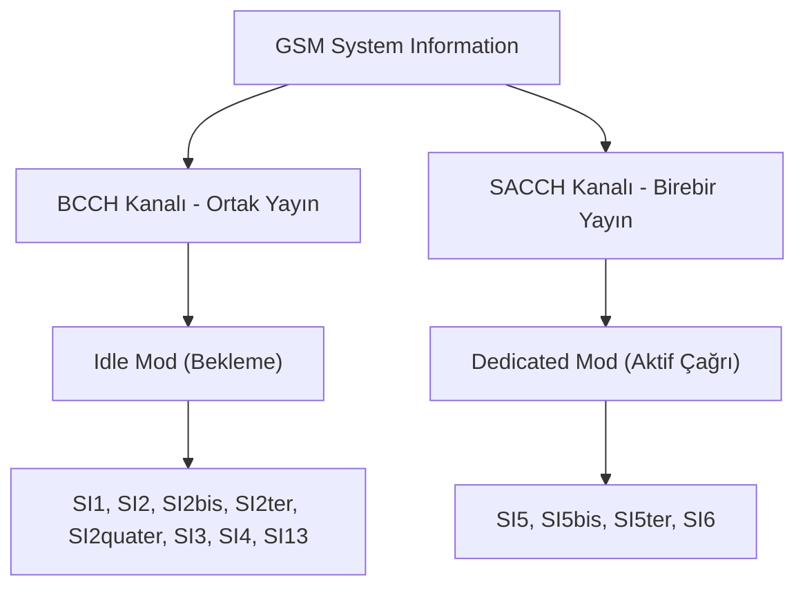

# GSM System Information (SI) Genel Yapısı

**GSM System Information (SI)** mesajları, bir GSM baz istasyonunun (BTS) kapsama alanındaki tüm mobil cihazlara (MS) kendi kimliğini, ağ parametrelerini, kanal yapılandırmalarını ve el değiştirme (handover/reselection) kurallarını yayınlamak için kullandığı kontrol mesajları grubudur.

LTE şebekelerindeki [[SIB Genel]] (System Information Block) yapısının GSM arayüzündeki karşılığıdır.

---

## 1. BCCH vs SACCH Kanal Yayınları ve Farkları

System Information mesajları, cihazın durumuna ve yayınlanma amacına göre iki farklı mantıksal kontrol kanalından havaya gönderilir:

### A. BCCH (Broadcast Control Channel) Üzerinden Yayın
* **Karakteristik:** Sürekli ve genel yayındır (Downlink only). Hücredeki tüm cihazlar tarafından okunabilir.
* **Cihaz Durumu:** Genellikle cihaz bekleme modundayken ([[GSM SI Genel|Idle Mode]]) bu kanalı dinler.
* **Yayınlanan SI Tipleri:** [[GSM SI1]], [[GSM SI2]], [[GSM SI2bis]], [[GSM SI2ter]], [[GSM SI2quater]], [[GSM SI3]], [[GSM SI4]], [[GSM SI13]].

### B. SACCH (Slow Associated Control Channel) Üzerinden İletim
* **Karakteristik:** Birebir adanmış (dedicated) arabağlantı kanalıdır. Aktif bir konuşma veya veri aktarımı sırasında ana trafik kanalına (TCH) eşlik eder.
* **Cihaz Durumu:** Cihaz aktif bir çağrıda ([[GSM SI Genel|Dedicated Mode]]) iken bu kanalı dinler.
* **Yayınlanan SI Tipleri:** [[GSM SI5]], [[GSM SI5bis]], [[GSM SI5ter]], GSM SI6.

---

## 2. Idle Mode vs Dedicated Mode Davranışları

Mobil cihazın şebeke içerisindeki konumuna ve durumuna göre okuduğu komşu listeleri ve hücre parametreleri değişiklik gösterir:

### A. Idle Mode (Bekleme Modu)
Cihaz açık durumdadır ancak aktif arama yapmamaktadır. Cihaz, en iyi sinyal kalitesine sahip baz istasyonunu bulmak ve ona kamp kurmak (Cell Reselection) amacıyla **BCCH** üzerinden yayınlanan komşu ARFCN listelerini ([[GSM SI2]], [[GSM SI2bis]], [[GSM SI2ter]]) sürekli olarak izler.
* **Komşu Hücre Listesi İsmi:** BA(BCCH) Allocation Listesi.

### B. Dedicated Mode (Adanmış Mod)
Cihaz aktif çağrıdadır. Görüşmenin kesilmemesi için (Handover) komşu hücre sinyal seviyelerini sürekli ölçer ve şebekeye raporlar. Bu sırada **SACCH** kanalı üzerinden gelen özel komşu ARFCN listesini ([[GSM SI5]], [[GSM SI5bis]], [[GSM SI5ter]]) kullanır.
* **Komşu Hücre Listesi İsmi:** BA(SACCH) Allocation Listesi.

---

## 3. Sistem Bilgi Blokları Özet Tablosu

| SI Tipi | Kanal | Durum | Ana İşlevi | Detay Sayfası |
| :---: | :---: | :---: | :--- | :--- |
| **SI 1** | BCCH | Idle | Hücre kanal tahsisatları (Cell Allocation) | [[GSM SI1]] |
| **SI 2** | BCCH | Idle | Temel bekleme modu komşu listesi (BA) | [[GSM SI2]] |
| **SI 2bis**| BCCH | Idle | E-GSM genişletme komşu listesi | [[GSM SI2bis]] |
| **SI 2ter**| BCCH | Idle | DCS-1800 çoklu bant komşu listesi | [[GSM SI2ter]] |
| **SI 2q**  | BCCH | Idle | Inter-RAT (3G/4G) komşu ve geçiş parametreleri | [[GSM SI2quater]] |
| **SI 3** | BCCH | Idle | Hücre kimliği (LAC/CID/MCC/MNC) ve cell selection | [[GSM SI3]] |
| **SI 4** | BCCH | Idle | Cell selection ek parametreleri ve CBCH yapısı | [[GSM SI4]] |
| **SI 5** | SACCH| Dedicated | Aktif çağrı modu komşu listesi (BA) | [[GSM SI5]] |
| **SI 5bis**| SACCH| Dedicated | Aktif çağrı modu ek komşu listesi | [[GSM SI5bis]] |
| **SI 5ter**| SACCH| Dedicated | Aktif çağrı modu DCS-1800 komşu listesi | [[GSM SI5ter]] |
| **SI 13** | BCCH | Idle | GPRS/EDGE hücre parametreleri ve RAC | [[GSM SI13]] |

---

## 4. İlgili Bağlantılar
* [[GSM Komsu Analizi]] — Komşu hücre tespiti mantığı.
* [[gr-gsm]] — Paketlerin havadan toplanmasında kullanılan araç seti.
* [[GSM ARFCN]] — Frekans ve kanal hesaplama altyapısı.
* [[SIB Genel]] — LTE tarafındaki eşdeğer yapı.
