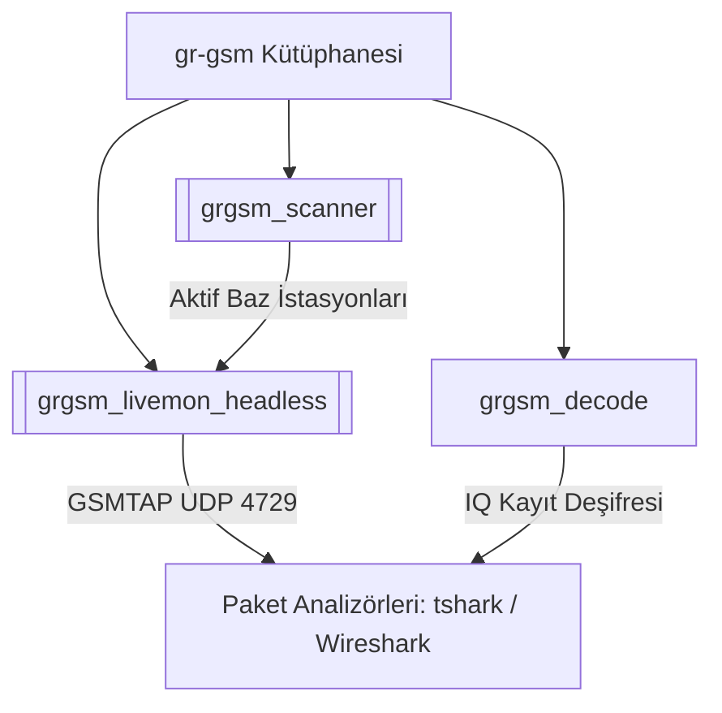

# gr-gsm (GNU Radio GSM Receiver)

**gr-gsm**, yazılımsal tabanlı radyolar (SDR) aracılığıyla GSM (Global System for Mobile Communications) hava arayüzünü (Um interface) alıcı modda dinlemek, taramak ve deşifre etmek için geliştirilmiş açık kaynaklı bir GNU Radio blok kütüphanesidir.

Sistemde, GNU Radio 3.10 sürümü ile birlikte gelen pybind11 geçişi ve API değişiklikleri nedeniyle orijinal `ptrkrysik/gr-gsm` projesinin uyumsuz kalması üzerine, 3.10 uyumlu **`bkerler/gr-gsm`** fork'u kaynak koddan derlenerek kurulmuştur.

---

## 1. Mimari ve Bileşenler

gr-gsm, GSM fiziksel katmanını (GMSK demodülasyonu, senkronizasyon, frekans ve zaman kayması düzeltimi) C++ katmanında çözerek, paket verilerini mantıksal kanallara (BCCH, SDCCH, TCH) dağıtır. 

Kütüphane ile birlikte sistem yöneticilerine sunulan üç temel araç şunlardır:

### A. [[grgsm_scanner]]
Bölgedeki aktif GSM baz istasyonu taşıyıcı frekanslarını (C0 veya BCCH kanalları) bulmak için tanımlı frekans aralıklarını hızlıca tarar. Baz istasyonunun yayınladığı System Information (SI) paketlerini yakalayarak hücre kimliğini (Cell ID), LAC, MCC, MNC ve komşu hücre listelerini ekrana yazdırır.

### B. [[grgsm_livemon_headless]]
Kullanıcının belirlediği tek bir baz istasyonu frekansına kilitlenerek gerçek zamanlı havadan yakalama (sniffing) gerçekleştirir. Headless sürümü, grafik arayüz (GUI) çalıştırmadan tamamen CLI üzerinden çalışır ve deşifre ettiği kontrol paketlerini **[[GSMTAP]]** UDP tünellemesi ile loopback arayüzüne gönderir.

### C. grgsm_decode
Çevrimdışı (offline) çalışır. Daha önceden kaydedilmiş ham IQ örnekleme dosyalarından (cfile) veya yakalanmış burst dosyalarından veri okuyarak mantıksal kanal deşifresi yapar. A5/1 ve A5/3 şifre çözme anahtarları (Kc) girilerek şifreli SMS ve ses verilerini deşifre edebilir.

---

## 2. bkerler Fork'unun Tercih Edilme Sebebi

Orijinal `ptrkrysik/gr-gsm` deposu GNU Radio 3.8/3.9 ve SWIG arayüz derleyicisi üzerine kuruludur. Debian 12 (Bookworm) ve GNU Radio 3.10+ içeren modern dağıtımlarda:
1. SWIG yerine modern **pybind11** arayüz geçişi yapıldığı için orijinal kod derlenemez.
2. `GrSwig` makro hataları fırlatır.
3. Python 3.11+ kütüphane yolları uyumsuzluk yaratır.

**`bkerler/gr-gsm`** fork'u, tüm C++ bloklarını pybind11 ile sarmalayarak modern Linux dağıtımlarında ve GNU Radio 3.10+ sürümlerinde sıfır hata ile derlenip çalışacak şekilde tasarlanmıştır.

---

## 3. Sistemdeki Yeri
Sistemde pasif tarayıcı olarak kullanılan donanım [[LimeSDR Mini 2.0]] ünitesidir. gr-gsm, `gr-osmosdr` katmanı aracılığıyla `SoapySDR` kütüphanesini kullanarak LimeSDR'a erişir. Dinlenen frekans $< 1.5$ GHz (GSM-900) ise SDR alıcı anten seçimi olarak **`LNAW`** portu set edilir.

---

## 4. İlgili Bağlantılar
* [[grgsm_scanner]] — Detaylı tarayıcı kılavuzu.
* [[grgsm_livemon_headless]] — Canlı dinleme aracı.
* [[GSMTAP]] — Deşifre edilen paketlerin kapsülleme standardı.
* [[GSM Komsu Analizi]] — GSM komşu hücresi tespiti ve SI yapıları.
