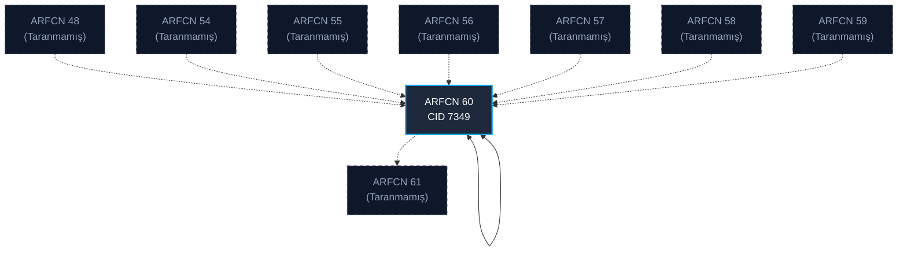

# GSM Komşu Haritası Matrisi

Bu sayfa, yapılan tüm GSM taramalarından derlenen ve servis hücrelerinin komşuluk ilişkilerini (BA listeleri) özetleyen master veri tabanı tablosudur.

## 🗺️ Görsel Topoloji Şeması

## 📊 İlişki Detay Matrisi

| Servis Hücresi | Servis CID | Komşu ARFCN | Komşu Band | Komşu Frekans | Komşu Operatör Tahmini | Yönlendirme | İlk Tespit Tarihi |
| :--- | :--- | :--- | :--- | :--- | :--- | :--- | :--- |
| [[Cell_GSM_ARFCN60]] | 7349 | 48 | GSM900 | 944.6 MHz | Turkcell | Taranmamış Keşif (Unscanned) | `2026-06-02` |
| [[Cell_GSM_ARFCN60]] | 7349 | 54 | GSM900 | 945.8 MHz | Turkcell | Taranmamış Keşif (Unscanned) | `2026-06-02` |
| [[Cell_GSM_ARFCN60]] | 7349 | 55 | GSM900 | 946.0 MHz | Turkcell | Taranmamış Keşif (Unscanned) | `2026-06-02` |
| [[Cell_GSM_ARFCN60]] | 7349 | 56 | GSM900 | 946.2 MHz | Turkcell | Taranmamış Keşif (Unscanned) | `2026-06-02` |
| [[Cell_GSM_ARFCN60]] | 7349 | 57 | GSM900 | 946.4 MHz | Turkcell | Taranmamış Keşif (Unscanned) | `2026-06-02` |
| [[Cell_GSM_ARFCN60]] | 7349 | 58 | GSM900 | 946.6 MHz | Turkcell | Taranmamış Keşif (Unscanned) | `2026-06-02` |
| [[Cell_GSM_ARFCN60]] | 7349 | 59 | GSM900 | 946.8 MHz | Turkcell | Taranmamış Keşif (Unscanned) | `2026-06-02` |
| [[Cell_GSM_ARFCN60]] | 7349 | 60 | GSM900 | 947.0 MHz | Turkcell | Karşılıklı (Bidirectional) | `2026-06-02` |
| [[Cell_GSM_ARFCN60]] | 7349 | 61 | GSM900 | 947.2 MHz | Turkcell | Taranmamış Keşif (Unscanned) | `2026-06-02` |
