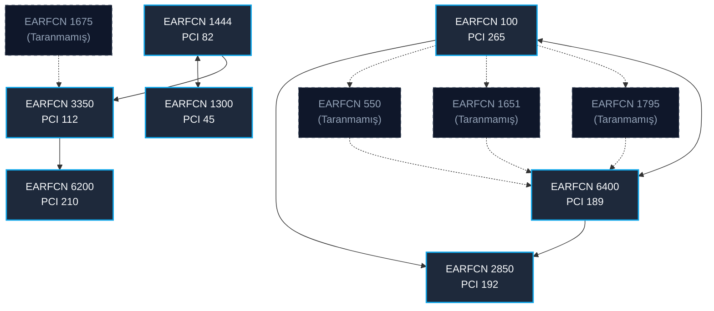

# LTE Komşu Haritası Matrisi

Bu sayfa, yapılan tüm taramalardan derlenen ve servis hücrelerinin komşuluk ilişkilerini özetleyen master veri tabanı tablosudur.

## 🗺️ Görsel Topoloji Şeması

## 📊 İlişki Detay Matrisi

| Servis Hücresi | Servis EARFCN | Servis PCI | Komşu Tipi | Komşu EARFCN | Komşu PCI | Yönlendirme | İlk Tespit Tarihi |
| :--- | :--- | :--- | :--- | :--- | :--- | :--- | :--- |
| [[Cell_EARFCN100_PCI265]] | 100 | 265 | Inter-Freq (LTE) | 2850 | 192 | Tek Yönlü (Unidirectional) | `2026-06-01` |
| [[Cell_EARFCN100_PCI265]] | 100 | 265 | Inter-Freq (LTE) | 550 | N/A | Taranmamış Keşif (Unscanned) | `2026-06-01` |
| [[Cell_EARFCN100_PCI265]] | 100 | 265 | Inter-Freq (LTE) | 1651 | N/A | Taranmamış Keşif (Unscanned) | `2026-06-01` |
| [[Cell_EARFCN100_PCI265]] | 100 | 265 | Inter-Freq (LTE) | 1795 | N/A | Taranmamış Keşif (Unscanned) | `2026-06-01` |
| [[Cell_EARFCN100_PCI265]] | 100 | 265 | Inter-Freq (LTE) | 6400 | 189 | Karşılıklı (Bidirectional) | `2026-06-01` |
| [[Cell_EARFCN3350_PCI112]] | 3350 | 112 | Inter-Freq (LTE) | 6200 | 210 | Tek Yönlü (Unidirectional) | `2026-06-01` |
| [[Cell_EARFCN3350_PCI112]] | 3350 | 112 | Inter-Freq (LTE) | 1675 | N/A | Taranmamış Keşif (Unscanned) | `2026-06-01` |
| [[Cell_EARFCN1444_PCI82]] | 1444 | 82 | Inter-Freq (LTE) | 1300 | 45 | Karşılıklı (Bidirectional) | `2026-06-01` |
| [[Cell_EARFCN1444_PCI82]] | 1444 | 82 | Inter-Freq (LTE) | 3350 | 112 | Tek Yönlü (Unidirectional) | `2026-06-01` |
| [[Cell_EARFCN1300_PCI45]] | 1300 | 45 | Inter-Freq (LTE) | 1444 | 82 | Karşılıklı (Bidirectional) | `2026-06-01` |
| [[Cell_EARFCN6400_PCI189]] | 6400 | 189 | Inter-Freq (LTE) | 2850 | 192 | Tek Yönlü (Unidirectional) | `2026-06-01` |
| [[Cell_EARFCN6400_PCI189]] | 6400 | 189 | Inter-Freq (LTE) | 100 | 265 | Karşılıklı (Bidirectional) | `2026-06-01` |
| [[Cell_EARFCN6400_PCI189]] | 6400 | 189 | Inter-Freq (LTE) | 550 | N/A | Taranmamış Keşif (Unscanned) | `2026-06-01` |
| [[Cell_EARFCN6400_PCI189]] | 6400 | 189 | Inter-Freq (LTE) | 1651 | N/A | Taranmamış Keşif (Unscanned) | `2026-06-01` |
| [[Cell_EARFCN6400_PCI189]] | 6400 | 189 | Inter-Freq (LTE) | 1795 | N/A | Taranmamış Keşif (Unscanned) | `2026-06-01` |
