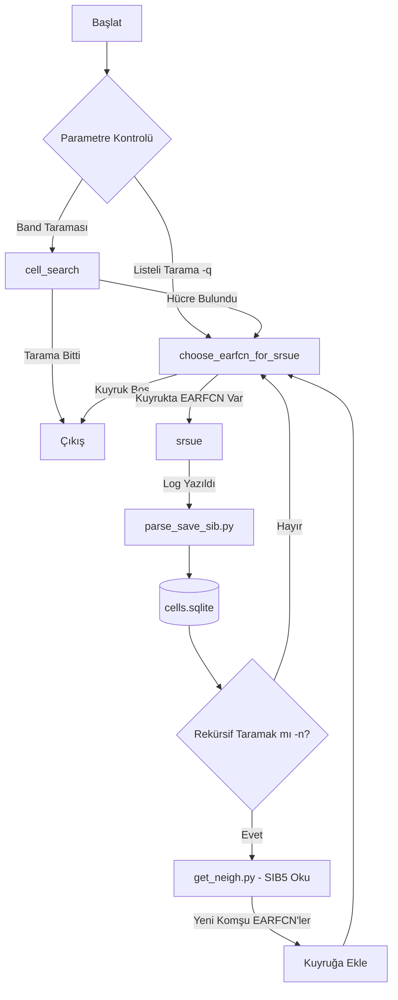

# `sib-scan.sh` Kullanım Kılavuzu ve Script Detayları

`sib-scan.sh` scripti, [[lte-sib-parser]] projesindeki radyo tarama ve SIB yakalama sürecini uçtan uca otomatize eden ana orkestrasyon betiğidir (orchestration script). Arka planda [[srsRAN]]'in `cell_search` ve `srsue` modüllerini koordine eder ve yakalanan verileri [[dbparsers]] Python betikleriyle işleyerek SQLite veritabanına kaydeder.

---

## 1. Parametre Listesi ve Açıklamaları

Script çalıştırılırken aşağıdaki opsiyonel ve zorunlu parametreleri alır:

- **`-h`**: Yardım mesajını görüntüler.
- **`-d`**: Kullanılacak RF cihazının adını belirtir (`UHD`, `soapy`, `bladeRF`). LimeSDR için genelde `soapy` tercih edilir.
- **`-a`**: Cihaza özel anten veya LNA parametrelerini gönderir (Örn: `"rxant=LNAH"` veya `"rxant=LNAW"`).
- **`-g`**: Alıcı kazancını (RX Gain) ayarlar (Varsayılan: `30` dB).
- **`-b`**: Taranacak LTE bandını tanımlar (Örn: `-b 3` veya `-b 20`).
- **`-s`**: Taramanın başlayacağı başlangıç [[EARFCN]] değerini belirtir.
- **`-e`**: Taramanın biteceği bitiş [[EARFCN]] değerini belirtir.
- **`-q`**: `cell_search` aşamasını atlayarak doğrudan elle belirtilen EARFCN listesini tarar (Örn: `-q "1675 6300 3050"`).
- **`-n`**: Rekürsif taramayı devre dışı bırakır. Sadece bulunan ilk hücreleri tarar, [[SIB5]]'ten gelen komşu EARFCN'leri kuyruğa eklemez.
- **`-t`**: SIB çözümü için `srsue` zaman aşımı süresi (Varsayılan: `30` saniye).
- **`-T`**: Başarıyla çözülen her yeni SIB için `srsue` çalışmasına eklenecek ek süre (Varsayılan: `30` saniye).
- **`-D`**: Sonuçların kaydedileceği SQLite veritabanı yolu (Konteyner içi varsayılan yol: `/vol/output/cells.sqlite`).

---

## 2. Çalışma Mantığı ve Rekürsif Tarama Akışı

Script temel olarak bir **Sonsuz Döngü (State Machine)** şeklinde tasarlanmıştır. Bu döngü içindeki ana durumlar (states) şunlardır:



### Rekürsif Keşif Mekanizması (Recursive Neighbor Discovery)
1.  Eğer `-n` parametresi verilmemişse, `srsue` bir EARFCN'i başarıyla dinleyip SIB verilerini kaydettikten sonra, `get_neigh.py` scripti çağrılır.
2.  `get_neigh.py` veritabanına giderek o hücrenin [[SIB5]] verisini okur ve orada tanımlanmış olan inter-frequency komşu [[EARFCN]] değerlerini çeker.
3.  Eğer bu komşu EARFCN'ler daha önce taranmamışsa, otomatik olarak **taranacaklar listesine (earfcn_need_scan)** eklenir.
4.  Böylece sistem, tek bir frekanstan başlayarak çevredeki tüm LTE spektrum katmanlarını zincirleme bir şekilde keşfetmiş olur.

---

## 3. Kullanım Örnekleri (Usage Examples)

### Örnek 1: Band 3 için Tam Rekürsif Tarama
LimeSDR Mini 2.0 kullanarak 1800 MHz bandını tara, bulunan hücreleri ve bu hücrelerin SIB5'inde tanımlı tüm komşu LTE frekanslarını rekürsif olarak keşfet:
```bash
./sib-scan.sh -d soapy -a "rxant=LNAH" -b 3
```

### Örnek 2: Belirli EARFCN Listesini Rekürsif Olmadan Tara
Sadece 1675 ve 6300 EARFCN kanallarını tara, komşularını kuyruğa ekleme ve verileri özel bir veritabanına kaydet:
```bash
./sib-scan.sh -d soapy -a "rxant=LNAW" -q "1675 6300" -n -D /vol/output/ozel_tarama.sqlite
```

### Örnek 3: Band 3'ün Belirli Bir EARFCN Aralığını Tara
Band 3'te sadece 1300 ile 1400 EARFCN aralığını tara ve sinyal kazancını 35 dB olarak ayarla:
```bash
./sib-scan.sh -d soapy -a "rxant=LNAH" -s 1300 -e 1400 -g 35
```

---

## 4. Sorun Giderme (Troubleshooting)

- **Zaman Aşımı Problemleri (`-t`)**: Sinyal seviyesi çok düşük olduğunda `srsue` MIB'i çözse bile [[SIB1]] veya SIB5'i yakalamakta zorlanabilir. Bu durumda `-t` parametresini artırarak (örn: `-t 60`) sinyalin yakalanması için cihaza daha uzun süre tanınabilir.
- **SDR Overflows / Veri Kaybı**: Ekranda sürekli olarak `O` (Overflow) harfleri çıkıyorsa, USB 3.0 portu kullanılmıyor olabilir veya host CPU yükü çok yüksektir (Detaylar: [[LimeSDR Mini 2.0]] ve [[Docker Kurulum]]).
- **Komşu Hücre Algoritması**: Komşu ağ mimarisinin mantıksal ayrıntılarını anlamak için [[Komşu Hücre Analizi]] ve [[Sistem Mimarisi]] dokümanlarını inceleyebilirsiniz.
